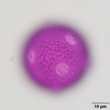
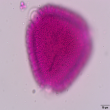
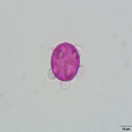
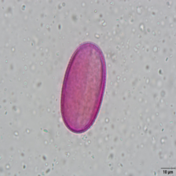
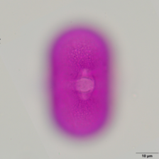
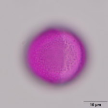

# Hierarchical Pollen Classification

This repository contains the codebase for our ICIP 2025 submission:  
**"Hierarchical Training Improves Consistency of Pollen Classification on the Family Level"**

## Abstract

Accurate classification of pollen grains plays a vital role in biology, medicine, and environmental monitoring. In this work, we propose a hierarchical deep learning framework that jointly optimizes predictions at the **family**, **genus**, and **species** levels. By training a shared feature extractor with parallel classifier heads, our method incorporates biological taxonomy into the training process.

We introduce a new dataset consisting of **1,787 microscopic pollen grain images** from **274 species**, **145 genera**, and **47 families**. Experiments show that our hierarchical approach improves family-level consistency while maintaining comparable species-level performance.

## Method Overview

- A shared backbone (ResNet50 or XLSTM) extracts image features.
- Three classifier heads predict:
  - **Family** (47 classes)
  - **Genus** (145 classes)
  - **Species** (274 classes)
- A combined loss function balances learning across all taxonomic levels.

## Dataset

The dataset contains annotated microscope images of pollen grains collected from **Bingöl, Türkiye**. Each sample is labeled at the family, genus, and species levels. The dataset was created by **Veysel Süzerer** from **Bingol University**.

## Example Images

You can access the dataset used in this project from the following link:

👉 [Download Dataset](https://drive.google.com/file/d/1oxW8eqFD6Y8ERuv7Vt2-p87rJXn6uKJF/view?usp=drive_link)

## Results

| Model | Level     | F1 Score | Accuracy | MCC   |
|-------|-----------|----------|----------|-------|
| ResNet50 (Hier.) | Family    | 0.707    | 0.849  | 0.832 |
| ResNet50 (Hier.) | Species   | 0.668    | 0.776  | 0.775 |
| XLSTM (Hier.)    | Family    | 0.674    | 0.835  | 0.816 |
| XLSTM (Hier.)    | Species   | 0.622    | 0.745  | 0.744 |

The results indicate that the hierarchical model improves or retains classification performance, particularly enhancing **family-level consistency**.
